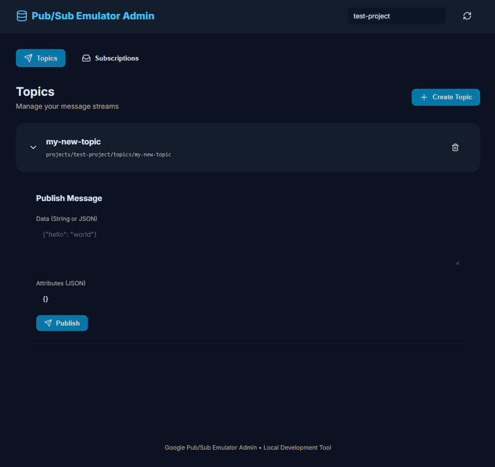

# PubSub Emulator UI

Uma interface web para interagir com o emulador do Google Cloud Pub/Sub. Esta ferramenta permite gerenciar tópicos e assinaturas, publicar mensagens e visualizar mensagens recebidas em um ambiente local de forma simples.



## Funcionalidades

- **Tópicos e Assinaturas**: Visualize e gerencie seus tópicos e assinaturas do Pub/Sub.
- **Publicador**: Publique mensagens em tópicos específicos com dados e atributos personalizados.
- **Assinante**: Visualize mensagens recebidas pelas assinaturas em tempo real.
- **Suporte a Docker**: Fácil implantação junto com o emulador Pub/Sub usando Docker Compose.

## Como Executar

### Usando Docker Compose (Recomendado)

1. Certifique-se de ter o Docker e o Docker Compose instalados.
2. Inicie os serviços:
   ```bash
   docker-compose up -d
   ```
3. Acesse a interface em `http://localhost:5173`.
4. O emulador Pub/Sub estará disponível em `localhost:10001`.

### Desenvolvimento Local

1. Instale as dependências:
   ```bash
   npm install
   ```
2. Inicie o servidor de desenvolvimento:
   ```bash
   npm run dev
   ```

## Tecnologias

- React
- TypeScript
- Vite
- Framer Motion
- Lucide React
- Google Cloud Pub/Sub Emulator
